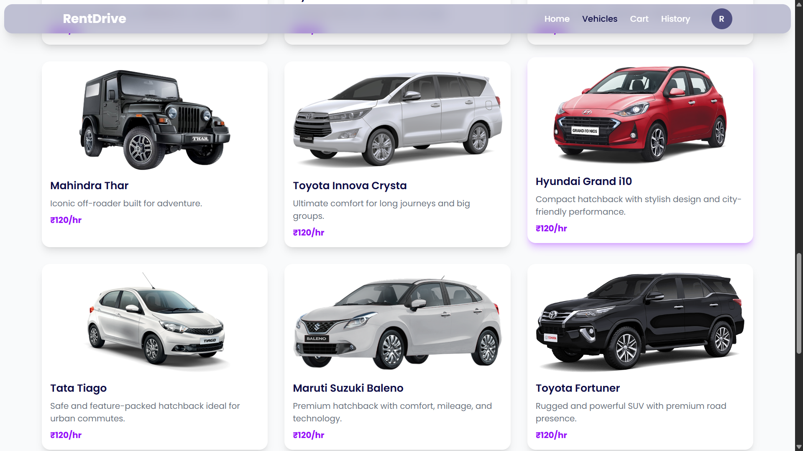
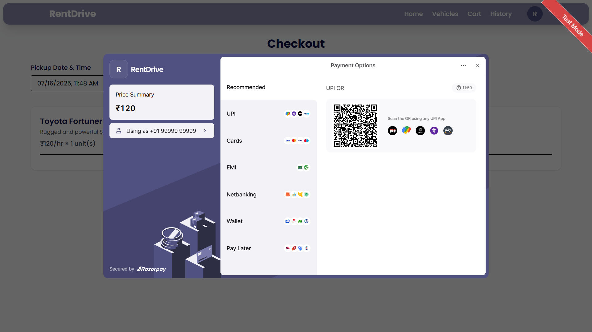

# 🚗 RentDrive – Car & Bike Rentals Web Application


A **fully responsive** and **feature-rich** vehicle rental application built with **React**, **Tailwind CSS**, **Firebase**, and **Razorpay**. Users can seamlessly browse, book, and pay for vehicles online with ease!


🔗 **Live Demo:** [https://rentdrive-b6985.web.app/](https://rentdrive-b6985.web.app/)

---

## ✨ Features

- ✅ **User Authentication** (Login, Registration, Logout)
- 🔐 **Email Verification** & **Forgot Password** via Firebase
- 📱 **Responsive UI/UX** with smooth animations using TailwindCSS + Framer Motion
- 🚗 **Vehicle Listing Page** with modals, filters, and categories
- 🛒 **Add to Cart** system with booking overview
- 💳 **Razorpay Payment Gateway Integration** (Test + Live Mode)
- 📆 **Pickup & Dropoff Time Selection** with `react-datepicker`
- 📜 **Booking History** with real-time Firestore data
- ⭐ **Rate & Review** system for each vehicle
- 🔒 **Private Routes** for authenticated access
- 📦 **SessionStorage + Firebase Firestore** for booking flow
- 🧠 **Smart Routing**, loaders, alerts, and context API management

---

## 🖥️ Tech Stack

| Tech         | Description                        |
|--------------|------------------------------------|
| React        | Frontend Framework (Vite Setup)    |
| Tailwind CSS | Modern Utility-first Styling       |
| Firebase     | Auth, Firestore DB, Hosting        |
| Razorpay     | Payment Gateway                    |
| Framer Motion| Animations & Modal Transitions     |
| React Router | Client-side routing                |
| React Hot Toast | Beautiful toast notifications |

---

## 🔐 Firebase Features

- 🔑 Email & Password Authentication
- ✅ Email Verification
- 🔁 Forgot Password Flow
- 🧾 Booking data stored securely in Firestore
- 🌐 Firebase Hosting with GitHub Actions

---

## 📸 Screenshots

📱Home Page  
---
🚗Vehicle Listing  
---
💳Payment  
---
---

## 🧪 Test Razorpay Payments

- Use test card: `4111 1111 1111 1111`
- Expiry: Any future date
- CVV: `123`
- Name: Any
- OTP: `123456`

---

## 🚀 How to Run Locally

```bash
git clone https://github.com/gokulraktate/Rental_Application.git
npm install
````

> ✅ Create a `.env` file and add your Razorpay Key:

```env
VITE_RAZORPAY_KEY_ID=your_key_here
```

> 🔑 Setup Firebase in `firebase.js` with your credentials.

```bash
npm run dev
```

---

## 📂 Folder Structure

```
├── src
│   ├── components/      # Navbar, Footer, Loader, etc.
│   ├── context/         # Cart & Auth Context
│   ├── pages/           # Home, Login, Payment, etc.
│   ├── firebase.js      # Firebase config
│   └── App.jsx          # Main app with routing
```

---

## 🏗️ Future Enhancements

* ✅ Admin Dashboard for managing listings
* 🌍 Location-based vehicle discovery
* 📩 Booking Confirmation Emails
* 📈 Analytics & Usage Tracking
* 💬 Chat Support System

---

## 🤝 Acknowledgements

* [Firebase](https://firebase.google.com/)
* [Razorpay](https://razorpay.com/)
* [Framer Motion](https://www.framer.com/motion/)
* [React Toast](https://react-hot-toast.com/)
* [React Datepicker](https://reactdatepicker.com/)

---

## 💻 Developed By

**Gokul Raktate**
🚀 Aspiring Full Stack Developer | React Enthusiast
🔗 [LinkedIn](https://www.linkedin.com/in/gokul-raktate-3a6789216/)

---
<!-- 
## 📜 License

This project is licensed under the [MIT License](LICENSE). -->


